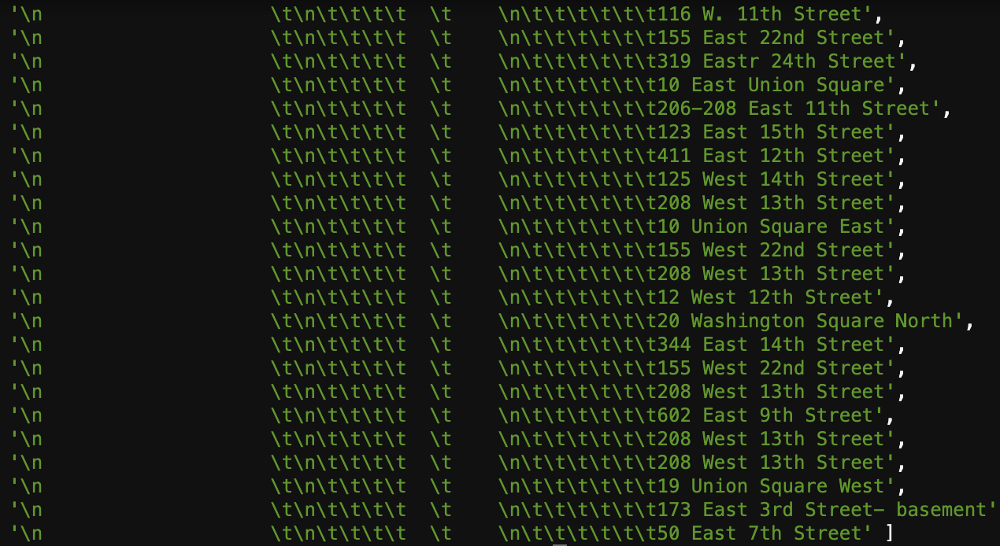

# Week2
The goal this week is to parse this page: http://parsons.nyc/aa/m03.html, which is saved in my local path from week1 and retrieve the street address of each event in a file in a local drive.


### 0. Require: fs, cheerio
Filesystem (fs) is required to save files in the local directory. (in our case, aws cloud)
Cheerio is used to make a quick selection for DOM element 


### 1. Make the Selection of the DOM element we need
There are multiple tables in this page, with nesting.
This inner most table contains individual event info. We are looking for a table inside a table inside a table. 
Inside the tbody of the innermost table, the first td cell of each tr contains the event address.

In a nut shell, this is what we are looking at.

```html
<table>
    <table>
        <table>
	   <thead>...</thead>
	   <tbody>
		    <tr>
			<td>
			    "Event address is appearing here"
			</td>
			<td>...</td>
			<td>...</td>
		    </tr>
		    ...
           </tbody>
        </table>
    </table>
</table>

```

To get to the event address, we make the following selection.

```javascript
$("table table table").find("tbody tr").find('td:nth-child(1)').each(function(i, elem) {
    // We'll use additional script here to retrieve the necessary substring later 
}
```

### 2. Data Cleaning
The first td cell selected above contains multiple lines. The address appears in the middle of a chunk of html text.
The following is the very first instance of such case, where we can decide what we need to remove in order to just get the street address.

```html
<td style="border-bottom:1px solid #e3e3e3; width:260px" valign="top">
    <h4 style="margin:0;padding:0;">McBurney YMCA</h4><br />
    <b>THE FELLOWSHIP CLUB - Fellowship Club</b><br />
	125 West 14th Street, 1st Floor Meeting Room, 
	<br />(Betw. 6th & 7th Avenues) NY 10011
	<br />
	<br />
                         
	<span style="color:darkblue; font-size:10pt;">
    Wheelchair access
    </span>
</td>
```
In this particular case, we just need to retrieve "125 West 14th Street".

To do that, 

(1) We first get rid of all h4, br annd b elements.

```javascript
    $(elem).find('h4').remove().html();
    $(elem).find('br').remove().html();
    $(elem).find('b').remove().html();
```

(2) Then we can get rid of what appears after the address. So, we remove span and image elements.

```javascript
  $(elem).find('span').remove().html();
  $(elem).find('image').remove().html();
```

(3) To get our street address, we only need the string that appears before the first comma.

```javascript
  let str = $(elem).html();  // This is our entire venue info string
  let firstComma = str.indexOf(','); // This gives the index of the first comma(,) within the string
  let myAddy = str.substring(0, firstComma); // We retrieve the necessary substring (Street Address) using the index above
```

(4) Push each item into an array 

```javascript
    myTexts.push(myAddy);
```

### 3. Additional Cleaning
After the above step, we get out of the loop inside the cheerio selection we made. 

Then, we work on additional step to get rid of \t (tab) and \n (new line) that seem to be included in each address.


We use string.trim() inside array.map() method to remove these extra stuff.

```javascript
const cleanedMyTexts= myTexts.map(item => item.trim());
```

### 4. Save the file
Finally, the street addresses are saved into a local drive.

```javascript
fs.writeFileSync('data/zone3_event_addresses.txt', cleanedMyTexts.join(`\n`));
```
