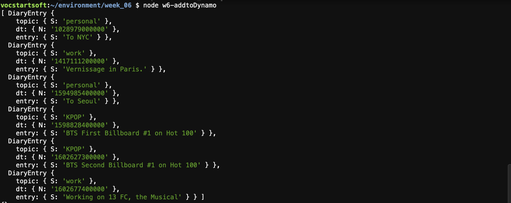
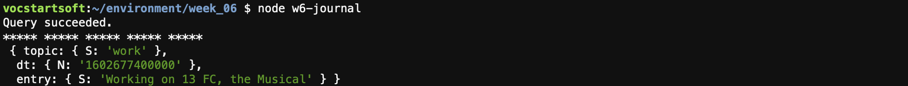

# Week6

### 1. AA Meeting Project 

A new table "aadata" has been created in PostgreSQL


```javascript
// Sample SQL statement to create a table (using ` quotes to break into multiple lines):
let query = `CREATE TABLE aadata (
    mtgday varchar(25), 
    mtgtime  varchar(25), 
    mtghour int, 
    mtglocation varchar(75), 
    mtgaddress varchar(75), 
    mtgregion varchar(75), 
    mtgtypes varchar(150)
);`;
```

It will be queried via SELECT "necessary columns" FROM "a table" WHERE "some conditions are met". 

```javascript
// Sample SQL statement to query meetings on Monday that start on or after 7:00pm: 
var thisQuery = "SELECT mtgday, mtgtime, mtglocation, mtgaddress, mtgtypes FROM aadata WHERE mtgday = 'Monday' and mtghour >= 7;";
```

For the aa meeting project, I need to re-parse the necessary information from the source html. 

### 2. Personal Diary Project
For the personal diary project, the main learning was that I needed to set up a partition key (topic, as a string) and also a sort key (dt, as a number) in order to create a composite primary key. Following is the primary key set up I created. 


####  Result Screen from the personal diary project with dynamoDB



I am following the following tutorial. 
https://github.com/samizdatco/ds-2020/tree/master/weekly_assignment_06
