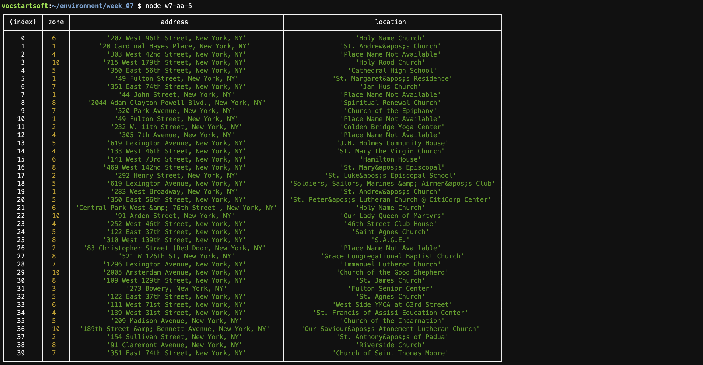
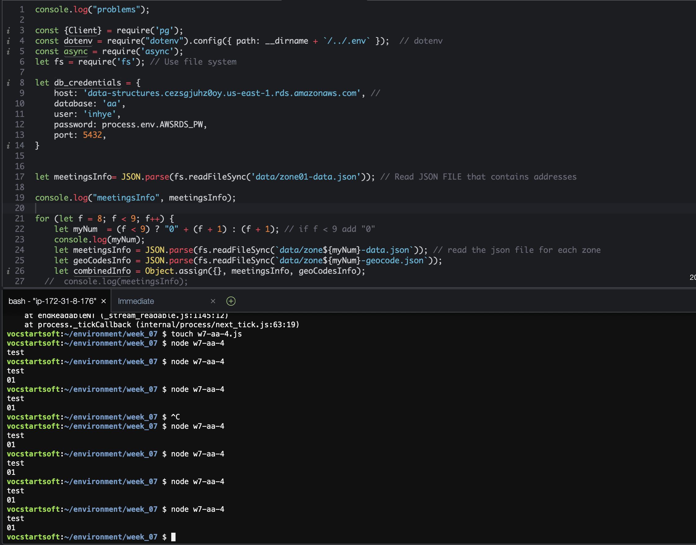

# Week 7

The goal for this week is to finish parsing necessary information from all 10 aa event pages, then insert them into postgresSQL.

The task is executed step-by-step as follows. 

#### w7-aa-1 
1. Parse and Save meetingsInfo from each event into a json.
=> I shall revisit this section later

#### w7-aa-2
2. Request Geocode information from TAMU geoservices using "address" information from the saved json. The Geocode is saved into a separate json file. 

#### w7-aa-3
3. Create a table with required fields in postgresSQL DB.

#### w7-aa-4
4. 
(1) Combine the two json files and create new object arrays.
(2) Insert data into the RDS table.

#### w7-aa-5
5. Test Querying information. 

#### Finding
I noticed that my amazon aws was sometimes acting weird, and would execute a file from its previous version of the same name js file and give me an error. On one occasion, I was not requesting postgresSQL in code, yet it gave me an error saying that it could not get connected to postgresSQL because of a password issue with my account. 
 
Following is another example. Shown in the picture attached,  my console.log("problems") result does not show up, when running the js file,  It is showing the result of console.log("test") which I had included in another file.

This problem was resolved later on, but I could not figure out where the source of this problem was. It created a point of doubt with regards to the stability of Amazon AWS cloud9 service.
